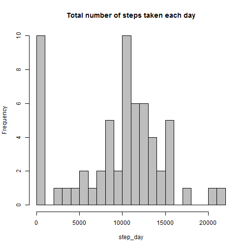
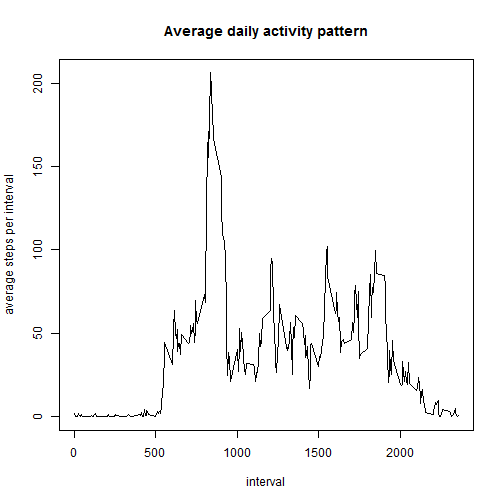
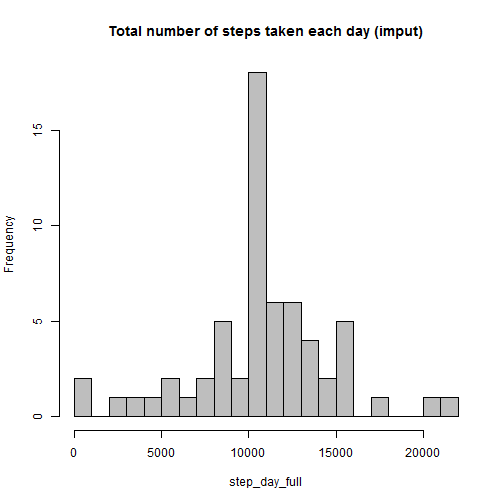
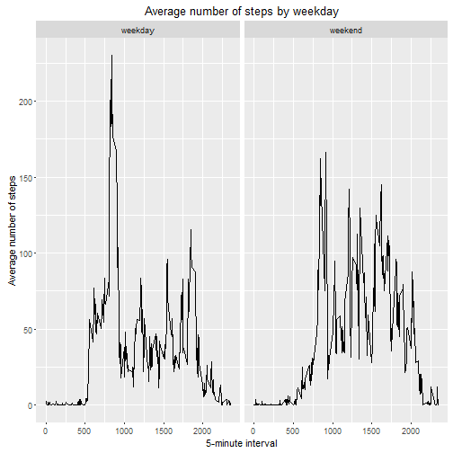

# Loading the data


```r
library(ggplot2)
library(plyr)
library(dplyr)
download.file("https://d396qusza40orc.cloudfront.net/repdata%2Fdata%2Factivity.zip", "dat.zip")
unzip("dat.zip")
dat <- read.csv("activity.csv")
```

#What is mean total number of steps taken per day?

* Calculating the total number of steps taken per day
* Plotting histogram of the total number of steps taken each day
* Calculating and reporting the mean and median of the total number of steps taken per day


```r
step_day <- with(dat, tapply(steps, date, sum, na.rm = TRUE))
hist(step_day, breaks = 30, col = "grey", main = "Total number of steps taken each day")
```



```r
mean(step_day)
```

```
## [1] 9354.23
```

```r
median(step_day)
```

```
## [1] 10395
```

#What is the average daily activity pattern?

* Making a time series plot (i.e. type = "l") of the 5-minute interval (x-axis) and the average number of steps taken, averaged across all days (y-axis)
* Finding out the interval containing the maximum number of steps


```r
step_ave <- aggregate(x = dat$steps, by = list(dat$interval), mean, na.rm = TRUE)
plot(step_ave$Group.1, step_ave$x, type="l", main = "Average daily activity pattern", xlab = "interval", ylab = "average steps per interval")
```



```r
## Maximum nuber of steps
step_ave[which.max(step_ave$x),]
```

```
##     Group.1        x
## 104     835 206.1698
```

#Imputing missing values

* Calculating and reporting the total number of missing values in the dataset (i.e. the total number of rows with NAs)
* Devising a strategy for filling in all of the missing values in the dataset
* Creating a new dataset that is equal to the original dataset but with the missing data filled in
* Making a histogram of the total number of steps taken each day and Calculate and report the mean and median total number of steps taken per day

We will use mean value across all days for each interval to fill missing data.


```r
dat2 <- dat
for(i in 1:nrow(dat)) {
      if(is.na(dat[i, "steps"]) == TRUE) {dat2[i, "steps"] <- round(step_ave[which(step_ave[,"Group.1"] == dat2$interval[i]),"x"], 2)}
      else(dat2[i, "steps"] <- dat2[i, "steps"])
}
step_day_full <- with(dat2, tapply(steps, date, sum, na.rm = TRUE))
hist(step_day_full, breaks = 30, col = "grey", main = "Total number of steps taken each day (imput)")
```



```r
c(mean.no.imput = mean(step_day),
  mean.with.imput = mean(step_day_full),
  median.no.imput = median(step_day),
  median.with.imput = median(step_day_full))
```

```
##     mean.no.imput   mean.with.imput   median.no.imput median.with.imput 
##           9354.23          10766.18          10395.00          10766.13
```

We see that mean and median with imputation are much closer to each other. Taking this fact into account and looking at the histogram we can assume that distribution is looking much more normal. It is likely that imputation  with mean value for each interval averages the data.

#Are there differences in activity patterns between weekdays and weekends?

* Create a new factor variable in the dataset with two levels – “weekday” and “weekend” indicating whether a given date is a weekday or weekend day
* Making a panel plot containing a time series plot (i.e. type = "l") of the 5-minute interval (x-axis) and the average number of steps taken, averaged across all weekday days or weekend days (y-axis)


```r
dat2$wk <- ifelse(as.POSIXlt(dat2$date)$wday %in% c(6,0), "weekend", "weekday")
step_day_full_pl <- ddply(dat2, .(interval, wk), summarise, steps = mean(steps))
qplot(data = step_day_full_pl, x = interval, y = steps, facets = .~wk, geom = "line", main = "Average number of steps by weekday", ylab = "Average number of steps", xlab = "5-minute interval")
```


